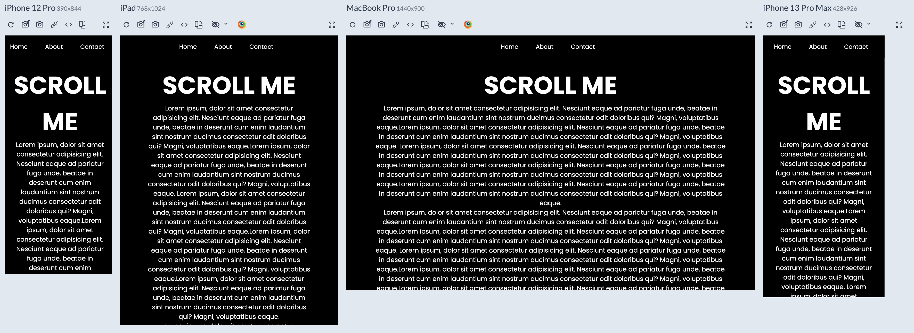

# Landing-page

Small Slider with JS-Library, CSS & HTML.
Mobile first .

## Demo
https://sticky-navbar-2024.netlify.app/

## Screenshots

## Appendix

I utilized JavaScript library : https://swiperjs.com/

and for animating the buttons : css

## Note - Keep in mind
REMEMBER THAT IF YOUR LAYOUT IS 

DESKTOP FIRST: IN MEDIA QUERIES GO "max-width" ">"

MOBILE FIRST: IN MEDIA QUERIES GO "min-width"  "<"

## 🛠 Skills
Javascript, HTML, CSS.

## 🚀 About Me
I'm a Junior full stack developer.
